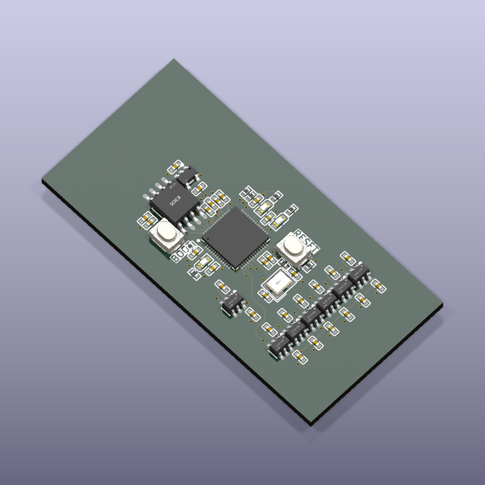
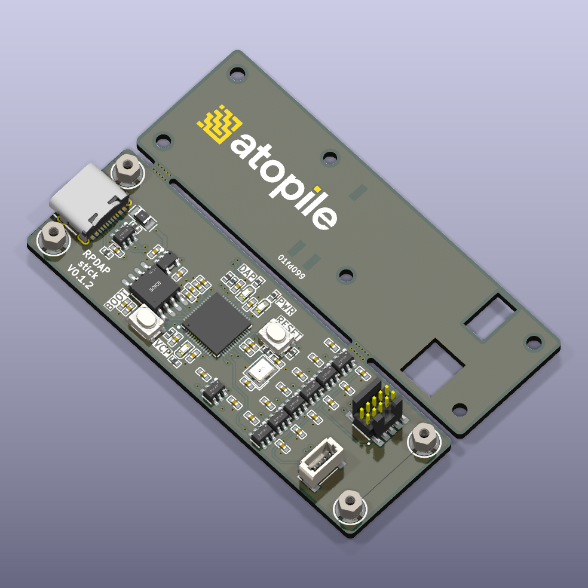
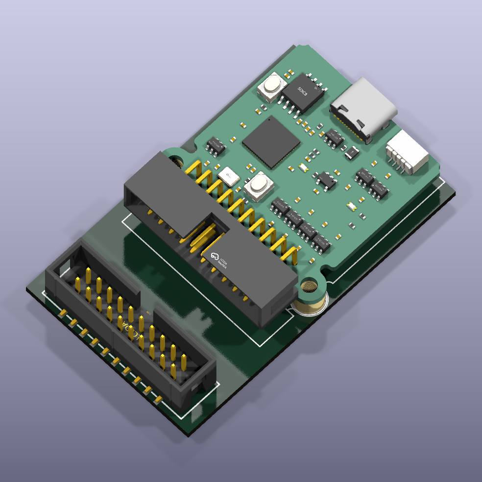

# RPDAP

 

CMSIS-DAP debugger hardware based on a Raspberry Pi RP2040 microcontroller.

   

## About

This project contains the hardware designs for a RP2040 based CMSIS-DAP debugger running the [free-dap](https://github.com/ruben-iteng/free-dap) firmware.

This project is build with [atopile](https://atopile.io).

### Features

- USB interface (data and power)
- status LEDs for VCP (Virtual COM Port), DAP status, and power.
- level shifted target interface (SWD, UART)
  - 1.2-5.5V target logic voltage

#### Layouts

There are various layouts and standalone boards available:

|   |   |
|---------------------------------------|---------------------------------------|
| Basic layout without connectors (for inclusion in your own design/PCBA) | Standalone stick shaped layout with female USB Type-C, Cortex-M debug header and 4-pin JST-SH UART connector. All inside a PCB enclosure. |
|    |  |
| Standalone RPDAP Compact board (JLink Base Compact compatible board shape) |  JLink Base Compact compatible "footprint" (for using as build-in debugger/programmer) |

### Firmware

The firmware for the debugger is available in the [free-dap](https://github.com/ruben-iteng/free-dap) repository.
Follow this standard RP2040 flashing procedure to flash the firmware.
