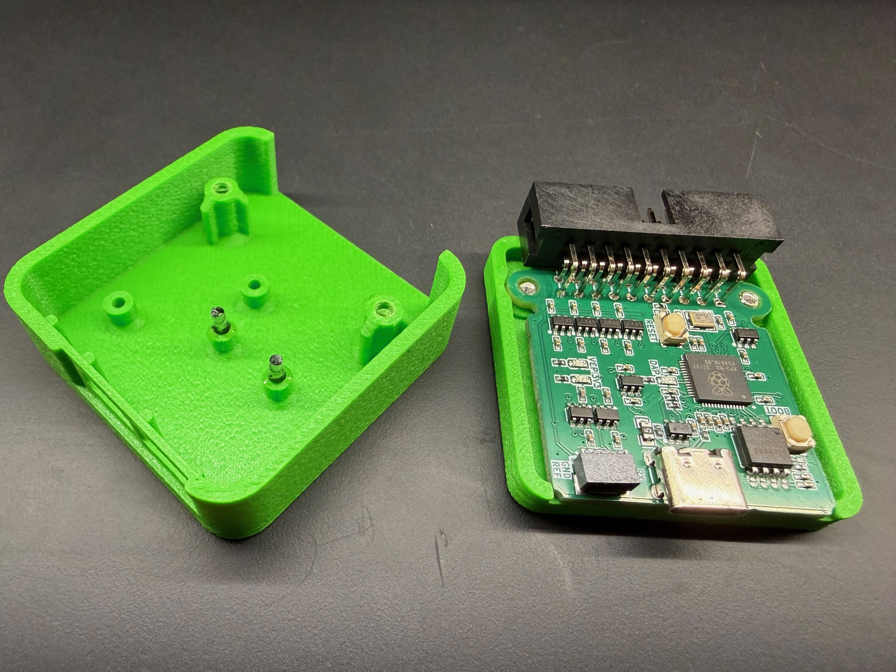
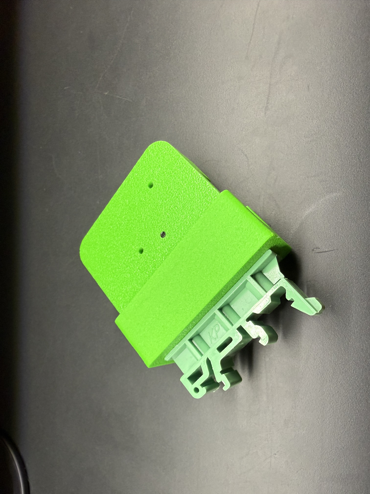

# CAD files

This directory contains the CAD files for an enclosure for the RPDAP compact board, including a DIN rail mount.

The enclosure is designed to be FDM 3D printed, and uses transparent filament for the light guides.
The following screws were used to put everything together:

- 2x M2.9X8 self tapping screws for plastic
- [Aliexpress part](https://nl.aliexpress.com/item/1005004102674045.html)

Optionally you can add these silicone feet at the bottom of the enclosure which will also give it a snug fit into the DIN rail mount.

- 1mm thick, 6mm diameter silicone feet
- [Aliexpress part](https://nl.aliexpress.com/item/1005008384264974.html)

